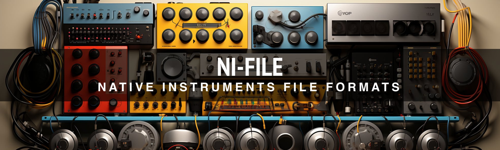

<p align="center">
  
</p>

# Native Instruments File Format

Native Instruments file format support for rust. This library is the result of hundreds of hours of painstaking reverse engineering and research.

## Features

- ✅ **Kontakt 4.22+** _partial support: NKS Container, Program, FileTable, Zones_
- ✅ **Kontakt 5-7** _partial support: NIS Container, Program, FileTable, Zones_
- ✅ **Kontakt FileContainer/Monolith**: _read support_
- ✅ **NCW Compression**: _read support - also available as a [cli utility](https://github.com/monomadic/ncw)_.

## Planned Features

- 🕒 Kontakt v1 _partial_
- 🕒 Kontakt v2 _partial_
- 🕒 FM8 _partial_
- ❌ WebAssembly / nostd _internal lz77 compression temporarily retired, needs refactoring to remove zlib dependency_
- ❌ All other NI formats...

Anyone who wants to join the effort, please join the telegram group at https://t.me/ni_file

I'm on telegram at `@deathdisco`.

## Usage

For the rust api check https://docs.rs/ni-file. For file schematics check the repository [docs](/doc/README.md) directory. There are also several [examples](/examples/) included which show more advanced usage.

You might also wish to check out my [working repository](https://github.com/monomadic/hexfiend-templates) of [hexfiend](https://hexfiend.com/) templates. This is where a lot of my work in reverse engineering file formats begins, and has some file information not present in this repository (and some other RE projects). If a file is not reading correctly with this library, the place to start looking is usually by having a set of these templates on hand and viewing the file with that.

## Installation

This is a library, but there are helper binaries in the examples folder:

- `ni-info` prints information about NI file formats.
- `ni-tree` prints the tree structure of NIS containers.
- `ni-extract` dumps internal preset data from NIS Containers, NKI Instruments and NIS FileContainers.
- `ni-convert` (coming soon) converts between formats

```bash
cargo install --path . --example ni-info
```

To just run the examples in place, try:

```bash
cargo run --example ni-info -- tests/data/nisound/file/**/*.nki
cargo run --example ni-info -- tests/data/nisound/file/**/*.nkm
```

## FAQ

Q: Why are you doing this?

A: Creating music with audio software is a totally ruined experience because of vendor lock-in. As a kid, I always hoped it would change. Several decades later here we are, worse than ever. So one of my life goals is to forcibly reverse engineer every proprietary audio format out there. Don't like it? Tough shit.

Also, I am a reverse engineer at heart, it's fun, and this is a good cause.

---

Q: What is the purpose of this library?

A: First, to document and expose these file types so that artists can have actual control of their own work, and second, to allow anyone to convert out of proprietary formats into open source standards. There are other use cases for this software, such as file support in third party software, but those are not interesting to me and not the primary focus of this knowledge work. Note that the focus is on reversing file formats for user-created NI files, not the proprietary heavily encrypted libraries - we are not trying to make it easy to pirate. But you should be able to convert libraries you created or bought that have nothing to do with NI.

---

Q: What can this library do?

A: It has been a long slog but finally various formats are starting to be supported. The focus is on Kontakt single instruments for now (all versions). You can currently decompress samples, extract a lot of information such as Key Zones and metadata. You could in theory write a SFZ conversion tool for example, but it would lack many features.

---

Q: Will there be write support?

A: Maybe, I doubt it, nothing is stopping anyone adding it but mostly I want to enable conversion to more open formats. Please get involved if you wish to see write support earlier.

---

Q: Can I help?

A: Please do! Join our [telegram group](https://t.me/ni_file) and we would be happy to answer any questions you have.
