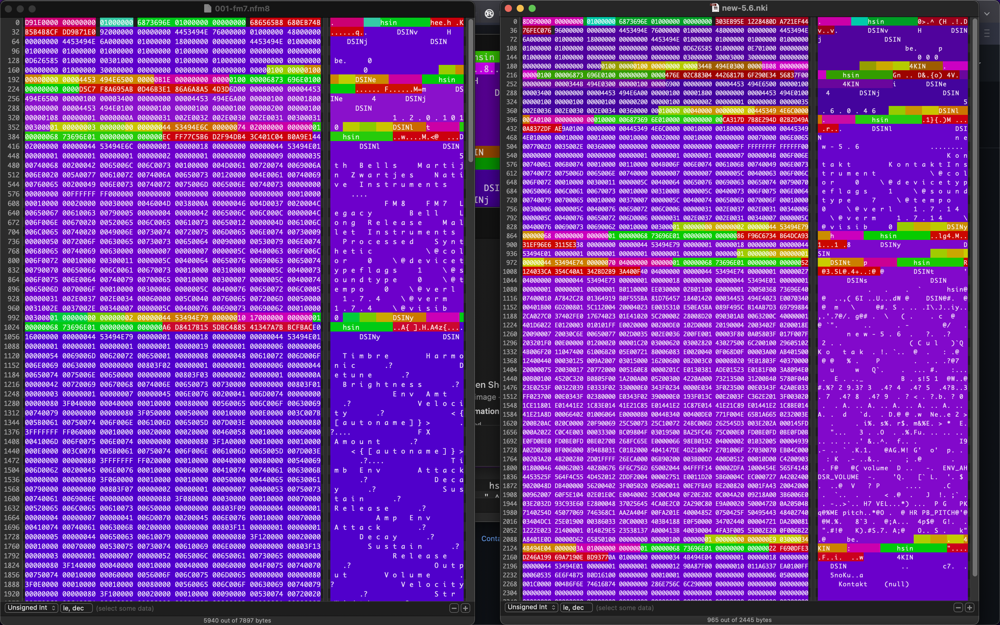
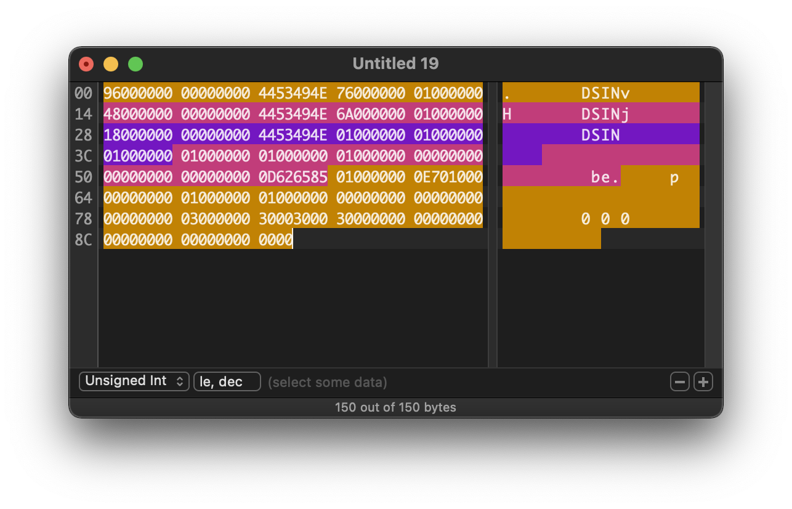

# Native Instruments File Format

UPDATE: The container format is fairly well understood now (enough to read blocks and extract files and presets), and compressed internal presets are spat out on all files of this type. From here, deciphering individual presets is much more straightforward.

Anyone who wants to do this with me, please get in touch. I'm on telegram at @deathdisco

Most of the source files are now unused as I transition to using `binread`. I'll clean everything up shortly.

## Installation

```
cargo install --path cli
```

## Progress

This library is a work in progress.

- [x] Detect various NI filetypes
- [x] Extract compressed presets from NI Containers (most NI files)
- [x] Extract files from Kontakt Monoliths
- [ ] Unencrypted presets
  - [~] Kontakt 4/5 Unencrypted Presets
  - [~] FM8
  - [ ] Kontakt 2
- [ ] Encrypted presets

There is no real code quality at this point, but this will follow once the container format is more discovered.

## NIContainer File Schematic

NI Containers are embedded hierarchical chunks of data.

The file is made up of nested segments, very similar to a linked list. There are two major kinds of segments header segments (`hsin`) and data segments (`dsin`). Header segments have more information and nest data segments. Here's a basic example colored with high level chunks.



The magic part is a char array denoted with 'hsin' tags / magic numbers. These tags are spelt backwards. For example

- `hsin` Native Instruments Start Header
- `DSIN` Native Instruments Start Data
- `4KIN` Native Instruments Kontakt 4
- `RTKR` ReaKToR
- `E8MF` FM8 E?

I still can't work out exactly how the checksum is calculated, but NI apps don't check for file integrity anyway.

### Data Chunks

Data chunks are tricky to load, they're recursive blocks like this:



### Compressed Presets

The main preset is compressed with a custom [LZ77](https://en.wikipedia.org/wiki/LZ77_and_LZ78) variant. deflate.rs can deflate a segment. The segment will start as normal, but appears to embed another file (with its own data segments, compressed) as data in a `DSIN` (type 115).

IMPORTANT: the compression starts 11 bytes into the data slice, but you must provide an initial dictionary of `00`.

## Serialised Data

### Strings

Most strings are [pascal widestrings](https://wiki.lazarus.freepascal.org/Character_and_string_types#WideString) or [shortstrings](https://wiki.lazarus.freepascal.org/Character_and_string_types#ShortString).

## Running

``` bash
cargo +nightly run -- test-data/deflated/002-fm7.nfm8.deflated
```
